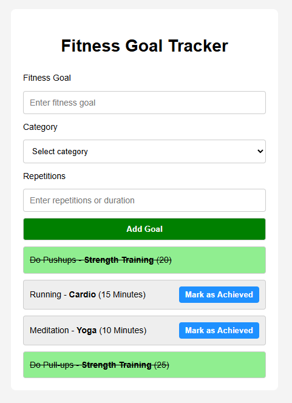

# Fitness Goal Tracker 🏃‍♂️💪

A simple fitness goal tracker built using **HTML**, **CSS**, and **JavaScript**.  
Persists data using `json-server` for mock backend functionality.

## Demo



## Features
- Add new fitness goals
- Choose category & duration
- Mark goals as achieved
- Goals persist via JSON server
- MVC code structure (model/view/controller separation)

## Setup
```bash
npm install
npm run start      # Start json-server on port 3000
npm run dev        # Launch live server (frontend)
